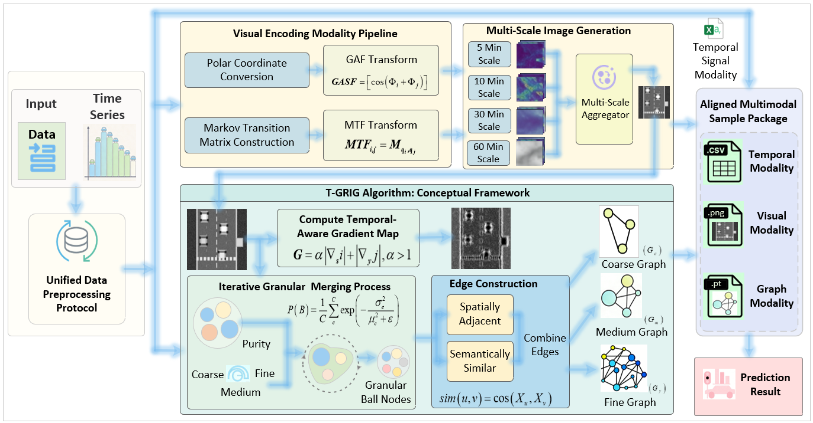

# GB-Traffic: A Multimodal Dataset for Traffic Prediction with Granular-Ball Graph Representations

This repository contains the official dataset and code for the paper: **"GB-Traffic: A Multimodal Dataset for Traffic Prediction with Granular-Ball Graph Representations"**.

## 📝 Overview

Multimodal traffic prediction lies at the intersection of multimedia databases and time series analysis. Existing benchmark datasets typically provide only raw time series and static physical distance graphs, which treat each sensor independently and assume spatial proximity implies functional similarity. This conventional paradigm suffers from critical gaps in dimensionality, structural abstraction, and granularity control.

**GB-Traffic** is the **first multimodal dataset** for traffic prediction that addresses these limitations by providing three aligned modalities:
1. **Raw Temporal Signals**
2. **Multi-Scale Time-Series Images**
3. **Granular-Ball Graphs** (generated by the proposed T-GRIG algorithm)

## ✨ Key Contributions

- **Novel Multimodal Dataset**: Integrates raw signals, multi-scale images, and semantic graphs, supporting controllable multi-granularity graph abstractions (coarse, medium, and fine).
- **T-GRIG Algorithm**: A tailored Traffic-aware GRanular-ball Image Graph algorithm that adaptively transforms traffic images into semantic graphs with four key enhancements:
  - Temporal-aware gradient computation
  - Multi-channel joint purity
  - Adaptive thresholding
  - Semantic edge construction beyond spatial adjacency
- **Extensive Benchmarking**: Unveils key findings challenging existing model-centric evaluation:
  - Granular-ball graph modality consistently outperforms physical graphs.
  - Model rankings shift across granularity levels.
  - Semantic representations improve cross-city transferability by approximately **15%**.
  - Graph nodes show interpretable mapping to temporal segments (e.g., morning peaks).

## 📊 Dataset Details

GB-Traffic seamlessly aggregates six representative real-world traffic datasets under a **unified data protocol**, covering diverse scenarios:
- **Highways**: PeMS04, PeMS08, METR-LA
- **Urban Bus Rapid Transit**: XMBRT
- **Metro Systems**: HZMetro, BJMetro

### Dataset Statistics
| Dataset | Domain | Nodes | Samples | Time Span |
| :--- | :--- | :--- | :--- | :--- |
| **PeMS04** | Highway | 307 | 16,992 | Jan-Feb 2018 |
| **PeMS08** | Highway | 170 | 17,856 | Jul-Aug 2018 |
| **METR-LA** | Urban Road | 207 | 15,120 | Mar-Jun 2012 |
| **XMBRT** | BRT | 44 | 4,297 | Oct-Nov 2018 |
| **HZMetro** | Metro | 276 | 2,677 | Feb-Mar 2018 |
| **BJMetro** | Metro | 80 | 5,593 | Jan 2019 |

*Format: 12 historical steps predict 12 future steps (12→12) at 5-minute intervals.*

### Unified Protocol
All datasets share a perfectly aligned standard setting for robust, cross-dataset evaluation:
- **Resampling**: 5-minute intervals via linear interpolation / averaging.
- **Task**: 12-step historical window (60 minutes) to predict the next 12 steps (60 minutes).
- **Data Splits**: Chronological splitting into training, validation, and test sets with a 6:2:2 ratio.
- **Data Packaging**: Each sample includes the raw 12-step sequence, a 128x128 multi-scale image, and three (coarse, medium, fine) granular-ball graphs.

## 🚀 Quick Start

A Python unified loader is provided to seamlessly interface with all six datasets. It supports batching, modality selection, and on-the-fly augmentation.

*(Code and usage instructions will be updated upon final release as mentioned in the paper: [https://github.com/Anna042023/GB-Traffic](https://github.com/Anna042023/GB-Traffic))*

